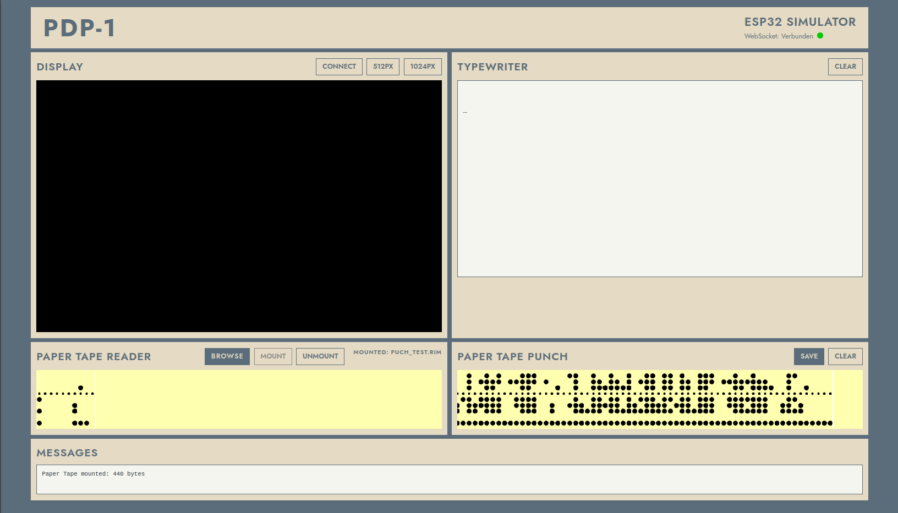

# ESP32 PDP-1 Simulator

A faithful emulation of the historic PDP-1 computer (1959) running on ESP32 microcontrollers with authentic front panel experience and modern web connectivity.
the emulation is written for my own Hardware-Simulator of the PDP1-Computer and its's full compatible to Oscar Vermeulens PiDP1-Computer with my ESP32-Adapterboard (gerber-files in this git), you can also connect to both versions my IoT-Backplane to connect real Hardware to the PDP-1 Simulator (Printers, Papertapereader, Relays, Led-Cubes, ADC, DAC, etc...)

The files for the web server are borrowed from the PiDP1, because i didn't want to reinvent the wheel when I built the adapter for the PiDP1.
A big Part of the code is build with the assistence of Claude AI .
**dont forget to put yout Wifi-Data in the webserver.h if you want to use this Feature.**


(picture from [Wikipedia.org]([PDP-1 - Wikipedia](https://en.wikipedia.org/wiki/PDP-1#/media/File:DEC_PDP-1_Demo_Lab_at_Mountain_View's_Computer_History_Museum.jpg)))

## Features

- **Multicore architecture** - CPU on Core 1, UI/WebSocket on Core 0
- **Two hardware versions** supported:
  - Version 1: MCP23S17 + PCF8574 via I2C
  - Version 2: PiDP-1 compatible LED matrix display
- **RIM loader** for authentic paper tape loading
- **Web interface** with:
  - Vector display emulation (WebGL)
  - Typewriter output
  - Paper tape reader/punch visualization
- **Backplane support** for external I/O devices (also in my Git to find)
- **SD card** support for program storage an Webserver-files

---

## Table of Contents

1. [Hardware Requirements](#hardware-requirements)
2. [Project Structure](#project-structure)
3. [File Descriptions](#file-descriptions)
4. [Implemented Opcodes](#implemented-opcodes)
5. [Webserver Features](#webserver-features)
6. [Installation](#installation)
7. [Usage](#usage)
8. [Serial Commands](#serial-commands)
9. [SD Card Structure](#sd-card-structure)
10. [Technical Details](#technical-details)

---

## Hardware Requirements

### Common Components

- ESP32 Adapter-Board for the pidp1 or my own ESP32-Pdp1
- SD card module (CS Pin 16)
- MCP23S17 SPI port expanders 

### Version 1 (MCP23S17 + PCF8574)

- 8x MCP23S17 for LED control (SPI, CS Pin 17)
- 7x PCF8574 for switch input (I2C via TCA9548A multiplexer)
- TCA9548A I2C multiplexer (Address 0x70)

### Version 2 (PiDP-1 Matrix)

- 2x MCP23S17 for LED matrix and switch scanning
- PiDP-1 compatible LED/switch matrix (7 LED rows, 3 switch rows, 18 columns)

### Optional: Backplane

- 7x MCP23S17 for backplane I/O (CS Pin 32)
- Interrupt pin for program flags (Pin 5)

---

## Project Structure

```
pdp1_simulator_multicore/
├── pdp1_simulator_multicore.ino   # Main sketch (multicore setup)
├── cpu.h                          # CPU core, RIM loader, interfaces
├── cpu_impl.h                     # Opcode implementations
├── version1.h                     # Hardware Version 1 (MCP23S17+PCF8574)
├── version2.h                     # Hardware Version 2 (PiDP-1 Matrix)
├── webserver.h                    # WiFi/WebSocket server
├── backplane.h                    # External I/O backplane support
└── web/                           # Web interface files (on SD card)
    ├── index.html
    ├── p7sim.js
    ├── papertape.js
    └── typewriter.js
```

---

## File Descriptions

### `pdp1_simulator_multicore.ino`

Main entry point and multicore orchestration.

| Section           | Description                                                                            |
| ----------------- | -------------------------------------------------------------------------------------- |
| Core Architecture | Core 0: UI, WebSocket, switches, display refresh. Core 1: PDP-1 CPU execution          |
| Global Flags      | `g_cpuShouldStop`, `g_cpuIsRunning`, `g_rimLoadingActive` for inter-core communication |
| `cpuTask()`       | FreeRTOS task running CPU on Core 1, handles instruction execution and LED updates     |
| `setup()`         | Initializes SPI, I2C, switches, LEDs, SD card, webserver, and starts CPU task          |
| `loop()`          | Main loop on Core 0 for switch handling, WebSocket management, and serial commands     |

### `cpu.h`

CPU class definition, RIM loader, and hardware abstraction interfaces.

| Component           | Description                                                  |
| ------------------- | ------------------------------------------------------------ |
| `ILEDController`    | Abstract interface for LED display controllers               |
| `ISwitchController` | Abstract interface for switch input controllers              |
| `PaperTapeStream`   | Virtual paper tape for RIM data reading                      |
| `RIMLoader`         | Authentic PDP-1 RIM format loader (SD card and web)          |
| `PDP1`              | Main CPU class with registers, memory, and execution control |

**PDP-1 Architecture Constants:**

```cpp
#define WORD_MASK   0777777    // 18-bit word
#define SIGN_BIT    0400000    // Sign bit position
#define ADDR_MASK   07777      // 12-bit address
#define MEMORY_SIZE 4096       // 4K words
```

**CPU Registers:**

- `AC` - Accumulator (18-bit)
- `IO` - I/O Register (18-bit)
- `PC` - Program Counter (12-bit)
- `MA` - Memory Address Register (12-bit)
- `MB` - Memory Buffer Register (18-bit)
- `OV` - Overflow flag
- `PF[1-6]` - Program Flags

### `cpu_impl.h`

Implementation of all CPU operations and opcodes.

| Function                   | Description                                               |
| -------------------------- | --------------------------------------------------------- |
| `handleSwitches()`         | Process front panel controls (START, STOP, EXAMINE, etc.) |
| `executeInstruction()`     | Main instruction decode and execute                       |
| `executeMemoryReference()` | Memory reference instructions (AND, ADD, LAC, etc.)       |
| `executeOperate()`         | Operate group instructions (CLA, HLT, etc.)               |
| `executeSkip()`            | Skip group instructions (SZA, SPA, etc.)                  |
| `executeShift()`           | Shift instructions (RAL, RAR, etc.)                       |
| `executeIOT()`             | I/O Transfer instructions                                 |

### `version1.h`

Hardware implementation for Version 1 (MCP23S17 + PCF8574).

| Class                | Description                                            |
| -------------------- | ------------------------------------------------------ |
| `SwitchControllerV1` | PCF8574-based switch input (7 chips at 0x20-0x26)      |
| `LEDControllerV1`    | MCP23S17-based LED output (8 chips) with mapping table |

**Switch Addresses (PCF8574):**

- `0x20-0x24`: Address switches, test word, sense switches
- `0x25`: Control switches (START, STOP, CONTINUE, etc.)
- `0x26`: Power, Single Step, Single Instruction

### `version2.h`

Hardware implementation for Version 2 (PiDP-1 compatible matrix).

| Class                | Description                                    |
| -------------------- | ---------------------------------------------- |
| `LEDControllerV2`    | 7-row × 18-column LED matrix with multiplexing |
| `SwitchControllerV2` | 3-row × 18-column switch matrix                |

**Matrix Layout:**

- Row 0: PC (16 LEDs)
- Row 1: MA (16 LEDs)
- Row 2: MB (18 LEDs)
- Row 3: AC (18 LEDs)
- Row 4: IO (18 LEDs)
- Row 5: Status LEDs (RUN, PWR, OV, etc.)
- Row 6: IR, Sense Switches, Program Flags

### `webserver.h`

WiFi and WebSocket server for web interface.

| Feature                 | Description                               |
| ----------------------- | ----------------------------------------- |
| `setup_wifi()`          | WiFi connection (STA mode)                |
| `setupWebserver()`      | AsyncWebServer + WebSocket initialization |
| `handleDisplayOutput()` | Buffer display points for WebGL rendering |
| `sendTypewriterChar()`  | Send typewriter output to browser         |
| `sendPunchData()`       | Buffer paper tape punch output            |
| `handleMountReader()`   | Mount paper tape from browser upload      |

**WebSocket Message Types:**
| Type | Direction | Description |
|------|-----------|-------------|
| `connect_dpy` | → ESP | Connect vector display |
| `disconnect_dpy` | → ESP | Disconnect vector display |
| `mount_reader` | → ESP | Mount paper tape (base64 encoded) |
| `unmount_reader` | → ESP | Unmount paper tape |
| `key` | → ESP | Keyboard input |
| `points` | ← ESP | Display point batch |
| `char` | ← ESP | Typewriter character |
| `punch_batch` | ← ESP | Paper tape punch data |
| `reader_position` | ← ESP | Tape reader animation position |

### `backplane.h`

External I/O backplane support via MCP23S17.

| Function                  | Description                     |
| ------------------------- | ------------------------------- |
| `bkp_mcp_init()`          | Initialize 7 MCP23S17 chips     |
| `bkp_set_io_value()`      | Output 18-bit IO register value |
| `bkp_set_ac_value()`      | Output 12-bit AC value          |
| `bkp_read_io_value()`     | Read 18-bit input value         |
| `bkp_read_programflags()` | Read 6-bit program flags        |
| `bkp_set_address()`       | Address decoder for I/O devices |

---

## Implemented Opcodes

### Memory Reference Instructions

| Octal | Mnemonic | Operation                                      |
| ----- | -------- | ---------------------------------------------- |
| 02    | AND      | AC ← AC ∧ M[Y]                                 |
| 04    | IOR      | AC ← AC ∨ M[Y]                                 |
| 06    | XOR      | AC ← AC ⊕ M[Y]                                 |
| 10    | XCT      | Execute instruction at Y                       |
| 16    | CAL      | Call subroutine (store AC at 100, jump to 101) |
| 17    | JDA      | Jump and deposit AC                            |
| 20    | LAC      | AC ← M[Y]                                      |
| 22    | LIO      | IO ← M[Y]                                      |
| 24    | DAC      | M[Y] ← AC                                      |
| 26    | DAP      | Deposit address part                           |
| 30    | DIP      | Deposit instruction part                       |
| 32    | DIO      | M[Y] ← IO                                      |
| 34    | DZM      | M[Y] ← 0                                       |
| 40    | ADD      | AC ← AC + M[Y] (one's complement)              |
| 42    | SUB      | AC ← AC - M[Y] (one's complement)              |
| 44    | IDX      | Increment and load AC                          |
| 46    | ISP      | Increment and skip if positive                 |
| 50    | SAD      | Skip if AC ≠ M[Y]                              |
| 52    | SAS      | Skip if AC = M[Y]                              |
| 54    | MUS      | Multiply step                                  |
| 56    | DIS      | Divide step                                    |

### Jump Instructions

| Octal | Mnemonic | Operation           |
| ----- | -------- | ------------------- |
| 60    | JMP      | PC ← Y              |
| 62    | JSP      | AC ← PC, OV; PC ← Y |

### Skip Instructions (64xxxx)

| Bits | Condition                  |
| ---- | -------------------------- |
| 0100 | Skip on zero AC (SZA)      |
| 0200 | Skip on positive AC (SPA)  |
| 0400 | Skip on negative AC (SMA)  |
| 1000 | Skip on no overflow (SNO)  |
| 2000 | Skip on positive IO (SPI)  |
| 0007 | Skip on program flag clear |
| 0070 | Skip on sense switch clear |

### Shift Instructions (66xxxx / 67xxxx)

| Octal | Mnemonic                    | Operation |
| ----- | --------------------------- | --------- |
| 66    | Shift left (RAL, RIL, RCL)  |           |
| 67    | Shift right (RAR, RIR, RCR) |           |

Shift count = number of 1-bits in address field.

### Operate Instructions (76xxxx)

| Bits | Operation                        |
| ---- | -------------------------------- |
| 0200 | CLA - Clear AC                   |
| 1000 | CMA - Complement AC              |
| 4000 | CLI - Clear IO                   |
| 0400 | HLT - Halt                       |
| 0100 | LAP - Load AC with PC            |
| 2200 | LAT - Load AC from test switches |
| 0010 | STFn - Set program flag n        |
| 0020 | CLFn - Clear program flag n      |

### I/O Transfer Instructions (73xxxx)

| Device | Mnemonic | Operation                                                           |
| ------ | -------- | ------------------------------------------------------------------- |
| 002    | RPB      | Read paper tape binary → IO                                         |
| 003    | TYO      | Typewriter output (FIODEC)                                          |
| 004    | TYI      | Typewriter input                                                    |
| 006    | PPB      | Punch paper tape binary                                             |
| 007    | DPY      | Display point (AC[0-9]=X, IO[0-9]=Y)                                |
| 012    | ---      | IoT Device for Example, sends AC and IO <br/>to the Backplane Ports |

---

## Webserver Features

### Vector Display

- WebGL-based rendering with phosphor fade effect
- 1024×1024 coordinate space (-512 to +512)
- Batched point transmission for smooth animation
- ~30 FPS update rate

### Typewriter Output

- FIODEC character encoding
- Real-time character streaming via WebSocket
- Supports CR/LF control characters

### Paper Tape Reader

- Browser-based file upload
- Base64 encoding for transmission
- Visual tape animation with position tracking
- Supports RIM format files

### Paper Tape Punch

- Batched binary output
- Visual hole pattern display
- Downloadable punched tape

---

## Installation

1. **Clone the repository:**
   
   ```bash
   git clone https://github.com/maklumatpemankanan/esp32-pdp1-simulator.git
   ```

2. **Install required libraries:**
   
   - [MCP23S17](https://github.com/maklumatpemankanan/MCP23S17) (my own Library for Arduino IDE)
   - ESPAsyncWebServer
   - AsyncTCP
   - ArduinoJson

3. **Configure version in `pdp1_simulator_multicore.ino`:**
   
   ```cpp
   #define USE_VERSION1  // or USE_VERSION2
   ```

4. **Optional features:**
   
   ```cpp
   #define BACKPLANE_SUPPORT    // Enable backplane I/O
   #define WEBSERVER_SUPPORT    // Enable web interface
   ```

5. **Configure WiFi in `webserver.h`:**
   
   ```cpp
   const char* ssid = "Your_SSID";
   const char* password = "Your_Password";
   ```

6. **Upload to ESP32**

---

## Usage

### Front Panel Operations

| Switch       | Function                                        |
| ------------ | ----------------------------------------------- |
| POWER        | Turn simulator on/off (shows random pattern)    |
| START ↓      | Start execution from current PC                 |
| START ↑      | Start execution from address switches           |
| STOP         | Halt CPU execution                              |
| CONTINUE     | Resume after halt                               |
| EXAMINE      | Display memory at address switches              |
| DEPOSIT      | Store test word at address switches             |
| READ IN      | Load RIM file from SD (folder = sense switches) |
| SINGLE STEP  | Enable step mode                                |
| SINGLE INSTR | Execute one instruction                         |

### Loading Programs

**From SD Card:**

1. Place `.rim` files in numbered folders (`/0/`, `/1/`, etc.)
2. Set sense switches to folder number
3. Press READ IN

**From Web Interface:**

1. Open browser to ESP32's IP address
2. mount `.rim` file
3. Press READ IN on front panel

if a File is mounted from the Webinterface the ReadIn is always from Web 

---

## Serial Commands

| Command    | Description                         |
| ---------- | ----------------------------------- |
| `l <file>` | Load RIM file from SD card          |
| `f`        | List files on SD card               |
| `m`        | Load LED test program               |
| `r`        | Start CPU                           |
| `s`        | Single step                         |
| `d [addr]` | Dump memory (octal address)         |
| `p`        | Print CPU status                    |
| `w`        | Print switch status                 |
| `t`        | Run LED test pattern                |
| `o`        | Turn off all LEDs                   |
| `x`        | Reset CPU                           |
| `i`        | Performance info                    |
| `b`        | Backplane test (if enabled)         |
| `a`        | Display test (if webserver enabled) |
| `h`        | Help                                |

---

## SD Card Structure

```
/
├── web/
│   └── index.html      # Web interface
├── 0/
│   └── program.rim     # Program for sense switch 0
├── 1/
│   └── program.rim     # Program for sense switch 1
├── 2/
│   └── program.rim
...
└── 12/
    └── program.rim     # Program for sense switch 12
```

---

## Webserver

open with your Browser with **http://Your-Ip-Address** and use the Webinterface.



---

## Technical Details

### Multicore Architecture

```
┌─────────────────────────────────────────────────────────────┐
│                         ESP32                                │
├────────────────────────────┬────────────────────────────────┤
│        CORE 0              │           CORE 1               │
│                            │                                │
│  ┌──────────────────┐      │      ┌──────────────────┐     │
│  │   Main Loop      │      │      │    cpuTask()     │     │
│  │                  │      │      │                  │     │
│  │  - Switch Poll   │ ←────┼──────│  - Instruction   │     │
│  │  - WebSocket     │ Mutex│Mutex │    Execution     │     │
│  │  - Serial Cmds   │ ────►┼──────│  - LED Update    │     │
│  │  - LED Matrix    │      │      │    (60 Hz)       │     │
│  │    (V2 refresh)  │      │      │                  │     │
│  └──────────────────┘      │      └──────────────────┘     │
│                            │                                │
│  Volatile Flags:           │                                │
│  - g_cpuShouldStop         │                                │
│  - g_cpuIsRunning          │                                │
│  - g_rimLoadingActive      │                                │
└────────────────────────────┴────────────────────────────────┘
```

### Memory

4096 18-Bit Words from 0000 - 7777

### RIM Format

The simulator reads RIM files very authentically. First, the RIM loader code is read from the tape in a special read-in mode. Then, the CPU starts the RIM loader from memory position 7751. The RIM loader program then processes the remaining part of the tape and starts the program.  

## License

MIT License

## Author

(c) 2025 Matthias Barthel

## Acknowledgments

- DEC for the original PDP-1 design (1959)
- [Oscar Vermeulen for the PiDP-1 project inspiration]([PiDP-1](https://obsolescence.dev/pdp1.html))
- [Pidp1-googlegroup](https://groups.google.com/g/pidp-1)

## Documents

- [F15D_PDP1_Handbook_Oct63.pdf](https://bitsavers.org/pdf/dec/pdp1/F15D_PDP1_Handbook_Oct63.pdf)

- [F17_PDP1Maint_1962.pdf](https://bitsavers.org/pdf/dec/pdp1/F17_PDP1Maint_1962.pdf)

- [F25_PDP1_IO.pdf](https://bitsavers.org/pdf/dec/pdp1/F25_PDP1_IO.pdf) 
